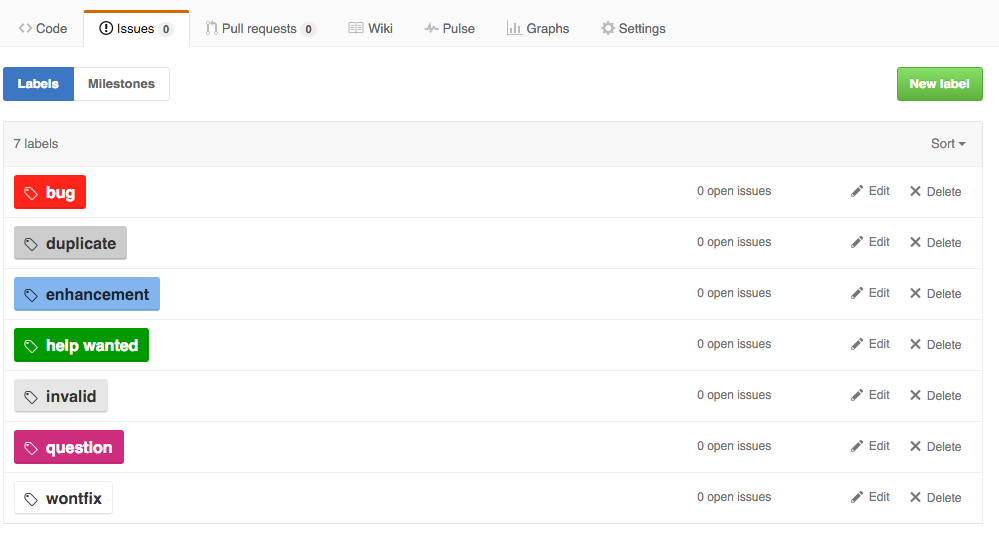
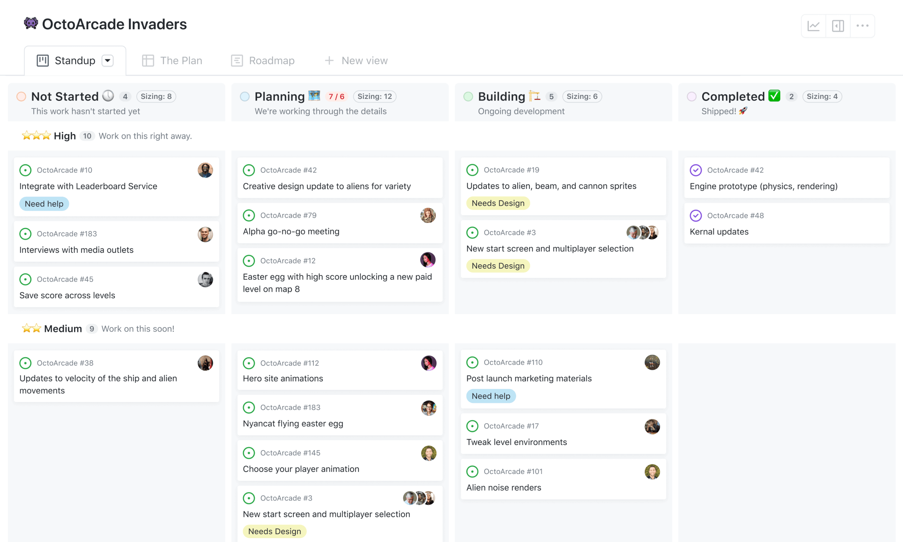

# 💡 Issue

GitHub **Issue** 예시 

 

## Issue란?

프로젝트에서의 **작업 단위**라고 할 수 있다.

└ **프로젝트 기획**, **새로 추가할 기능**, **버그 수정**, **최적화할 기능(개선 사항)** 등 모든 작업

 

## Issue 관리

- 프로젝트에서 발생되는 작업들을 이슈로 생성하여 관리한다.
- 이슈를 생성하여 관리하면, 이슈에 대한 히스토리를 하나의 이슈 페이지에서 관리가 가능하며 어떤 작업을 해야 하는지, 누가 작업해야 하는 지에 대한 정보를 한 곳에 묶어서 관리할 수 있다.
- 이슈 생성 시, 이슈번호가 '#123' 형식으로 부여되는데 이를 통해 이슈 관리가 가능하다.
- Comment 기능을 통해 하나의 이슈 페이지에서 서로의 의견을 주고 받을 수 있어 작업을 단위로 구분하여 협업 및 관리하기 수월하도록 해준다.
- 이슈 생성 시 label을 부여하여 이슈의 성격을 나타낸다. (e.g. bug, plan, develop, ...)

 

## Label

GitHub **Label**예시

 

- 이슈의 성격, 특징을 나타내는 Tag라고 할 수 있다.

- 내가 작성한 이슈가 어떤 특징을 갖고 있는지, 어떠한 상태인지를 태깅하여 label을 부여하는 것이다.

 

**e.g.**

- `bug`: 버그 수정
- `develop`: 기능 개발
- `documentation`: 문서화, 문서작업

 

## Issue 관리 Flow

1. **A**라는 기능을 개발해야 하는 상황이 발생

2. **A** 기능 개발에 대한 **Issue**를 생성

3. develop 브랜치로부터 **A** 기능 개발에 대한 feature 브랜치 분기

4. 생성한 feature 브랜치에서 **A** 기능 개발 시작

   4-1. 이 때 커밋 메시지에 #이슈번호(e.g. #7, #53, ...)를 첨부해주면 해당 이슈 페이지와 커밋 메시지가 연결돼서 이슈 관리가 좀 더 수월해진다.

 

***

# 📋 Project

GitHub **Project** 예시

 

## Project란?

- 프로젝트는 작업의 진행도를 한 눈에 볼 수 있고, 이슈들을 하나의 **Task(작업)**로 나타내서 그 작업이 어느정도 진행되었는지 확인하고 관리할 수 있는 메뉴이다.
- 원하는 뷰 형식으로 사용할 수 있지만 일반적으로 칸반 보드(Kanban board) 형태로 사용한다.

(Kanban board 형식 뷰)

## Project 활용

프로젝트 탭을 통해 팀 개발 스케줄링을 한다.

프로젝트 카테고리는 **To Do**, **In Progress**, **Completed**, **Test**, **Done** 5개 영역으로 한다.

- **To Do**: 기획되고 설계를 마친 기능 중에 아직 진행되지 않은 개발 목록
- **In Progress**: **To Do**에서 개발을 진행하기 시작한 것들과 **Test**단계에서 버그가 발견돼서 버그 수정이 필요한 것들
- **Completed**: 개발이 완료되어 QA(테스트)하는 것을 대기중인 작업들
- **Test**: 개발이 완료된 것들에 버그가 있는지, 의도한 대로 잘 작동하는지 검증하는 QA가 진행 중인 작업들
- **Done**: **Test**단계에서 버그가 발견되지 않고 의도대로 잘 작동하여 완료된 작업들

 

***

# 🏴 Milestone

GitHub **Milestone**예시

 

## Milestone이란?

Issue가 하나의 작업이라면 **Milestone**은 작업 방향의 **이정표**이다.

>마일스톤의 유래는 고대 로마제국의 아우구스투스 황제 시절, 그들은 로마의 길에 1마일마다 돌을 세워서 표시한 것으로부터 비롯된다.
>
>이 돌은 여행자들이 그들이 현재 로마의 길에 있다는 것을 인지하게 하고, 두 지점간의 평균적인 거리 감각을 갖게 하기 위해 존재했다고 한다.

 

## Milestone 활용

마일스톤은 프로젝트에서 중요한 이벤트를 표시하는 **기준점**이며 프로젝트의 진행도를 파악하기 위해 사용된다.

만약 내 프로젝트가 A -> B -> C -> D의 과정을 거쳐 만들어져야 한다면 각각의 A, B, C, D 마일스톤을 만들고 각각의 마일스톤에 이슈를 붙여가며 현재 내 프로젝트의 진행도를 파악하는 용도인 것이다.

하나의 마일스톤에는 여러개의 이슈가 등록될 수 있다.