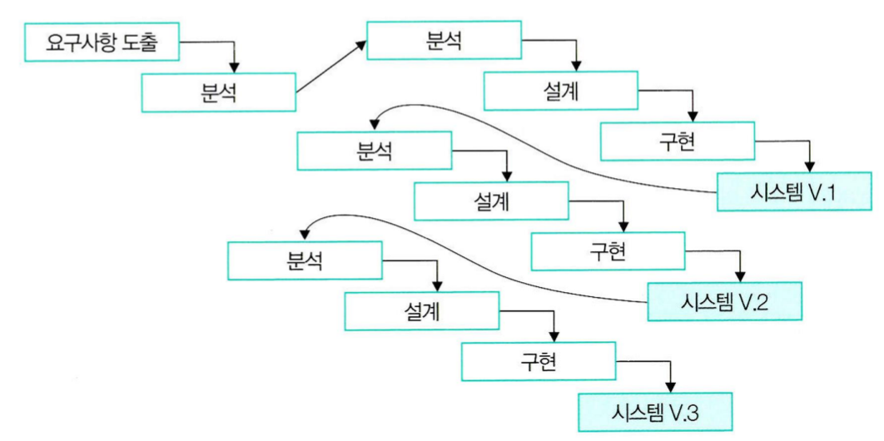

# 🚩 프로젝트 기본 방침

## 📃 문서화

### 도구

- **문서 작성**: 한글(.hwp)
- **시스템 모델링**: draw.io
- 

 

 

## 📋 소프트웨어 개발 프로세스

**개발 프로세스**: 점진적 모델(Incremental model)

 

### 계획

[역할 분담]

 

### 분석

 

### 설계

 

### 구현&테스트

 